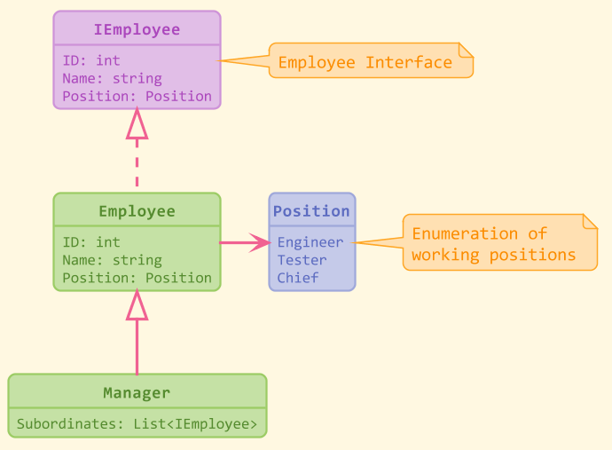

# What is this?
Its just a stylesheet that you can apply on your PlantUML diagrams

# How can i use it?
1) Copy <stylesheet_murning.iuml> to your local machine;
2) Add stylesheet path into your digram like this:
> !include c:/Murning/stylesheet_murning.iuml
3) Refresh diagram.

# So how it looks?

